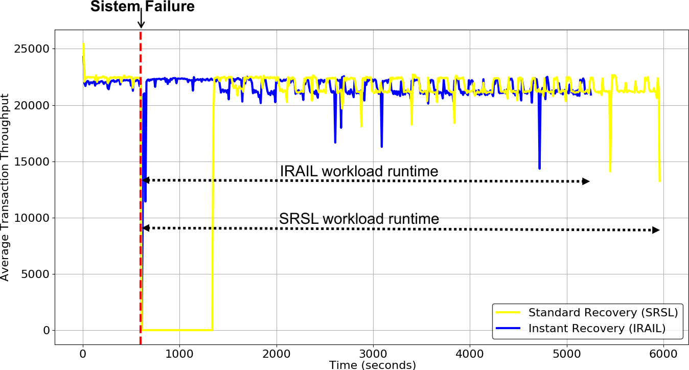
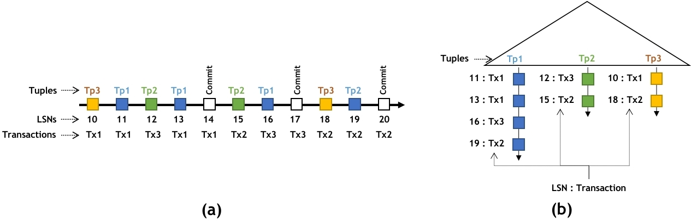
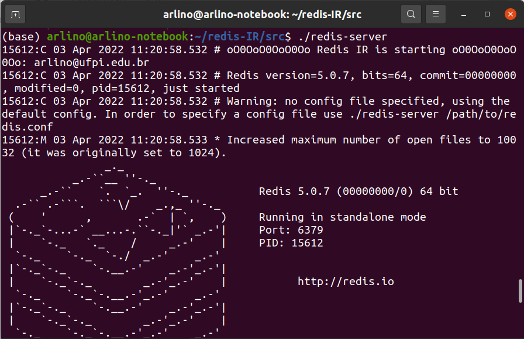
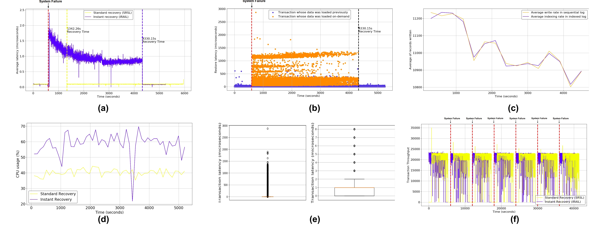

# MM-DIRECT

### 1. General Information

Main Memory Databases (MMDBs) technology handles the primary database in Random
Access Memory (RAM) to provide low latency and high throughput. However, volatile
memory makes MMDBs much more sensitive to system failures (power cut, e.g.). The
contents of the database are lost in these failures, and, as a result, systems may be unavail-
able for a long time until the database recovery process has been finished. For example,
after a failure, standard recovery of Redis database (similar to recovery implemented by
most MMDBs) must recover the database completely in memory before performing new
transactions.

Novel recovery techniques are needed to repair crashed MMDBs as quickly as
possible. MM-DIRECT is a fork of Redis that implements a instant recovery technique. The
instant recovery technique enables MMDBs to schedule transactions simultaneously with
the database recovery process at system startup. Thus, applications and users do not notice
the recovery process, giving the impression that the system was instantly restored. Since
the instant recovery approach schedules transactions as quickly as possible, it delivers
higher IOPS rates, i.e., it is able to run workloads faster.

Figure 1 shows two recovery experiments: instant recovery implemented by
MM Direct (blue line) and standard recovery implemented by most MMDBs (yellow line).
The graphic lines represents the average transaction throughput over small time intervals.
Looking more closely at Figure 1, one may observe that the standard recovery approach
has downtime after a failure while the database is recovering. On the other hand, the
instant recovery approach schedules transactions immediately after the system starts up
during the recovery process.
<div align="center" style="text-align:center; margin-top: 20px; margin-bottom: 20px;">

</div>

**Figure 1. Transaction throughput during database recovery: Instant Recovery
vs. Default Recovery**

The default recovery needs to scan the sequential log file (Figure 2 (a)) com-
pletely to recover the database. The instant recovery uses an indexed log file (Figure 2(b)) to recover a failed database instead of a sequential log file. The indexed log is an
index structure (e.g., B+-tree or Hash table) that allows to restore tuples into memory in-
crementally or on-demand. Section 11 shows some articles for more details about instant recovery approach.

<div align="center" style="margin-top: 20px; margin-bottom: 20px;">

</div>

### 2. How to install MM-DIRECT
MM-DIRECT can be builded on Ubuntu 20.04 or earlier. However, the prototype was tested
only on Ubuntu 20.04, 18.04, and 16.04.
The following libraries are required for building MM-DIRECT:
1. `C++ compiler`
2. `Libconfig` (libconfig-dev)
3. `Berkely DB` (libdb-dev)

### 2.1. Installing C++ compiler

```bash
sudo apt install build-essential
```

### 2.2. Installing Libconfig

```bash
sudo apt-get update -y
sudo apt install libconfig-dev
```

### 2.3. Installing Berkely DB

```bash
sudo apt-get update
sudo apt-get install libdb-dev
```

### 2.4. Installing MM-DIRECT

```bash
git clone https://github.com/ArlinoMagalhaes/MM-DIRECT.git
cd MM-DIRECT
make
```

### 3. Using MM-DIRECT

### 3.1. Running MM-Direct server

Enter on ”MM-DIRECT/src” directory and run the command below:
    
```bash
./redis-server
```

Figure 3 shows the Redis-IR database system running.

<div align="center" style="text-align:center; margin-top: 20px; margin-bottom: 20px;">

</div>

### 3.2. Typing commands
Redis has a built-in client, called redis-cli (Redis command line interface), that allows
to interact with the database system. The redis-cli is a terminal program used to send
commands to and read replies from the Redis server. To use redis-cli, enter on ”MM-DIRECT/src” directory and run the command below:
    
```bash
./redis-cli
```

The SET command inserts a key/value into the database. The command below
inserts the key key1 with the value value1. Run the command in redis-cli.

```bash
set key1 value1
```

The GET command retrieves a value from the database using a key. The command
below gets the value value1 using the key key1. Run the command in redis-cli.

```bash
get key1
```

### 3.3. Shuting down and restarting the server

Try to shout down the database system and run it again to observe the instant recovery.
Use the following command on redis-cli to shout down the database system:

```bash	
shutdown
```

Large log files are required to better observe the instant recovery process. Thus,
it is necessary to put the system into production to generate large log files. Section 6.1
show how to generate a database using a benchmark tool.

### 4. Configuring MM Direct

The MM-DIRECT settings are stored in the **redis_ir.conf** file in the MM-DIRECT root directory.

### 4.1. Enabling instant recovery

The instant recovery can be enabled setting the instant recovery state field to ”ON” value.
The default value of that field is ”ON”, i.e., MM-DIRECT runs instant recovery by default.

```bash
instant_recovery_state = "ON"
```

If the value of instant recovery state is ”OFF”, the system will run the default
recovery of Redis, i.e., it will run a sequential log recovery. In this case, transactions can
be performed only after the recovery process is completed.

### 4.2. Enabling synchronous indexing

The instant recovery technique uses a indexed log. For performance reasons, the inser-
tions in the indexed log are asynchronous to transaction commit, i.e., a transaction should

not wait for insertions on the indexed log to commit. However, the indexing can be syn-
chronous, i.e., each transaction update must wait the log insertions to confirm its writes.

To enable the synchronous indexing, set the instant recovery synchronous field to ”ON”
value. The default value of that field is ”OFF”.

```bash
instant_recovery_synchronous = "ON";
```

### 4.3. Changing the indexed log file data structure

MM-DIRECT use a B+-tree as indexed log file by default, but it can use a Hash table too. The
indexedlog structure field enables to change the indexed log data structure. The default
value of that field is ”BTREE”.

```bash
indexedlog_structure = "BTREE"; //BTREE | HASH.
```

### 5. Benchmarking

MM-DIRECT can use Memtier benckmark to simile workloads. Memtier is a high-throughput
benchmarking tool for Redis developed by Redis Labs. This tool has a command-line
interface that provides a set of customization and reporting features to generate various
workload patterns. Redis and Memtier are different programs and must be run separately.
However, MM-DIRECT was implemented to use Memtier automatically.

### 5.1. Installing Memtier Benckmark

The following libraries are required for building Memtier:
1. libevent 2.0.10 or newer
2. libpcre 8.x
3. OpenSSL (unless TLS support is disabled by ./configure –disable-tls)

On Ubuntu/Debian distributions, simply install all Memtier prerequisites as fol-
lows:

```bash
sudo apt-get install build-essential autoconf automake libpcre3-dev libevent-dev pkg-config zlib1g-dev libssl-dev
```

Although Memtir and Redis are different programs, we put Memtier inside MM-DIRECT so that the former could be automatically executed by the latter. Thus, to build and
install Memtier, enter in ”MM-DIRECT/src/memtier_benchmark” directory and run the follow-
ing commands:

```bash
autoreconf -ivf
./configure
make
sudo make install
```

 Access Memtier’s git for more information about the tool: https://github.com/RedisLabs/memtier_benchmark.

### 5.2. Using Memtier automatically on MM-DIRECT

The usage of Memtier by MM-DIRECT should be set in the redis ir.conf file. Thus, before
running the MM-DIRECT server, the field memtier benchmark state should be set to ”ON”
value to start Memtier automatically together with the server. The default value of that
field is ”OFF”.

```bash
memtier_benchmark_state = "ON";
```

A Memtier workload is configured using some parameters in the
**memtier_benchmark_parameters** field. Below are two examples of workload pa-
rameters:

**Example 1**: creates a workload that generates a database containing 5,000 tuples.

```bash
memtier_benchmark_parameters = " --hide-histogram -n 5000 --key-prefix=´redisIR-´ --key-minimum=1 --key-maximum=5000 --command=´set__key__ __data__´ --command-ratio=5000 --command-key-pattern=S"
```

These parameters generate 5,000 command requests per client. Fifty clients are handled
per each thread by default. Four threads are handled by default. The prefix of the key
name is defined as ’redisIR-’. The key name suffix is on range 1-5000. A key example:
redisIR-1999. The operations are SET commands. The parameter ” key ” generates
keys using the defined range. The parameter ” data ” generates values by Memtier
default object options. The key generation pattern is sequential (S).

**Example 2**: simulates a OLTP workload for the database generated in the Exam-
ple 1 (above).

```bash
memtier_benchmark_parameters = " --hide-histogram -n 5000 --ratio 5:5
--randomize --key-prefix=´redisIR-´ --key-minimum=1 --key-maximum
=1000"
```

These parameters generate 5,000 random commands per client in a ratio 5:5 between SET
and GET commands. The prefix of the key name is changed to ’redisIR-’. The key name
suffix is on range 1-1000.

There are other examples of workload parameters in redis ir.conf file. To see all
Memtier setting options, run the following command on Memtier root directory:

```bash
./memtier_benchmark --help
```

### 6. Simulating databases

MM-DIRECT implements persistence only by its log files. MM-DIRECT creates a sequential log
file, called **sequentialLog.aof**, and an indexed log file, called **indexedLog.db**. Both files
are generated together during transaction processing and stored in the **MM-Direct/src/logs**
directory.

### 6.1. Creating a database using Memtier

Memtier can be used to simulate workloads to generate databases. Below is a example
of workload parameters that create 5,000 database tuples and 20,000,000 log records.
After the workload parameter is set, the database system should be started (see Section
3.1). Besides, Memtier should be enabled to run automatically together the system (see
Section 5.2).

```bash
memtier_benchmark_parameters = " --hide-histogram -n 5000 --key-
prefix=’redisIR-’ --key-minimum=1 --key-maximum=5000 --command=’set

__key__ __data__’ --command-ratio=5000 --command-key-pattern=S"
```

The above workload should be executed some times to generate log files large
enough to better observe the instant recovery process. The same workload can be run
a given number of times by setting the memtier benchmark workload run times field.
The default value of that field is 1.

```bash
memtier_benchmark_workload_run_times = 10
```

The indexed log tends to grow a lot over time. Thus, it is recommended that the
indexed log checkpoint be enabled for faster recovery. The checkpoint can be activated
through the configuration parameter below:


```bash
checkpoint_state = "ON"
```

### 6.2. Changing the name of the log files used by MM-DIRECT

Optionally, log file names can be renamed.

To change the sequential log file name, set the aof filename field.
    
```bash
aof_filename = "logs/sequentialLog.aof";
```

To change the indexed log file name, set the indexedlog filename field.

```bash
indexedlog_filename = "logs/indexedLog.db";
```

### 6.3. Backing up the database

It is possible to back up a database storing the sequential and indexed log files in another
device. Besides, there is a file, called ”**finalLogSeek.da**t”, responsible to synchronizes the
log insertions from the sequential log to the indexed log. Thus, this file should be stored
together the log files.

### 7. Simulating workloads

Memtier can simulate workload patterns. For instance, it is possible to accesses only a
subset of a database through multiple clients to simulate a OLTP workload.

### 7.1. Creating OLTP workloads using Memtier

The parameter bellow generates a workload that accesses 20% of the database created in
the Section 6.1 example.

```bash
memtier_benchmark_parameters = " --hide-histogram -n 5000 --ratio 5:5
--randomize --key-prefix=’redisIR-’ --key-minimum=1 --key-maximum
=1000"
```

### 8. Simulating system failures

MM-DIRECT has some settings to simulate system failures. A system failure is simulated by
a system shutdown and then a system restart. Failure simulations can be triggered with or
without a workload execution. Section 7 shows how to simulate workloads using Memtier
benchmark.

### 8.1. Triggering system failures

It is possible to simulate system failures by the number restarts after time field. This
field allows to program a given number of failure simulations. If the field value is zero,
no failure is done. The field’s default value is 0 (zero).

```bash
number_restarts_after_time = 4;
```

The restart after time field represents the time (in seconds) to simulate a failure
from the system startup. If the field value is 0 (zero), no failure is done. The default value
is 600 seconds.

```bash
restart_after_time = 1200;
```

### 8.2. Triggering failures during normal DBMS processing
It is also possible to simulate a failure during normal database processing. In this case,
first the database is loaded entirely into memory and only then the system is available
for new transactions. Only after that, a failure is done after a given time. To do this,
the preload database and restart field should be set with the database failure time (in
seconds). If that field value is 0 (zero), nothing is done, i.e., the system will not be
preloaded or restarted.

```bash
preload_database_and_restart = 300
```

### 8.3. Triggering sucessive failures

Successive failures can be simulated after the database system is preloaded using the field
named number restarts after preloading. This field is the number of system failures to
be simulated. The default value of that field is 1. If that field has the value 0 (zero), no
failure is preformed, i.e., the system is only preloaded. The time of the successive failures
is set by restart time after first restart field. The time of the first failure is set by the
preload database and restart field. The default value of restart time after first restart
field is the same value of preload database and restart field.

```bash
number_restarts_after_preloading = 5
2 restart_time_after_first_restart = 6000
```

Optionally, successive failures can be performed using the num-
ber restarts after time field, described in Section 8.1. However, the system will
not be preloaded in memory and the time taken for successive failures will necessarily be
the same as for the first failure.

### 9. Reporting recovery

MM-DIRECT is able to produce simple reports with information about the system recovery,
such as: recovery time, workload execution time, number of operations performed, CPU
and memory usages, and others. In addition, features of each client operation performed
on the database can be stored in CSV files. The reports may be enabled in redis ir.conf
file before the system starts.

### 9.1. Generating recovery report

The recovery report shows information about the recovery process, such as: re-
covery time, total workload execution time, number of tuples recovered incremen-
tally and on demand, among others. The recovery report is enabled by setting the
generate recovery report field to ”ON”. Thus, a text file is stored in the redis-
IR/src/recovery report directory.

```bash
generate_recovery_report = "ON"
```

Additionally, the name of the recovery report file can be modified by the recov-
ery report filename field.

```bash
recovery_report_filename = "recovery_report/recovery_report.txt";
```

### 9.2. Generating report about executed database operations

It is possible to generate a CSV file containing information about performed database
operations. The CSV file contains the fields: key of the tuple updated, command of
the operation, start time of the operation, finish time of the operation, and type of the
operation. The first file line contains the database startup time. Besides, the file can con-
tain information about Memtier workload execution, checkpoints performed, and failures
simulated (shutdowns). The CSV file of executed command features can be generated by
setting the generate executed commands csv field to ”ON” value. Thus, a CSV file is
stored in the MM-DIRECT/src/datasets directory.

```bash
generate_executed_commands_csv = "ON"
```

Additionally, the name of the CSV file can be modified by the exe-
cuted commands csv filename field.

```bash
executed_commands_csv_filename = "datasets/dataset.csv";
```

It is important to note that at each system startup the report files are overwritten.
Thus, it is necessary to set the field overwrite report files to ”OFF” if experiments with
system failures are performed.

```bash
overwrite_report_files = "OFF"
```

### 9.3. Generating report about log files’ write bandwidth

The sequential log write operation is potentially faster than the indexed log write opera-
tion. However, MM-DIRECT implements a buffer mechanism in the indexed log to mitigate

the problem of a potential low write bandwidth. It is possible to generate a graph to
measure and compare write bandwidth in the sequential log file and in the indexed log
file. To do that, a CSV file containing indexed log writes can be generated by setting
generate indexing report csv field to ”ON”.

```bash
generate_indexing_report_csv = "ON"
```

Additionally, the name of the CSV file can be modified by the index-
ing report csv filename field.

```bash	
executed_commands_csv_filename = "indexing_report/indexing.csv";
```

### 9.4. Generating report about system usage

It is possible to generate information about the system CPU (in percentage) and RAM (in
kilobytes) usages. To do that, the system usage state field must be set to ”ON”.

```bash
generate_system_usage = "ON"
```

Additionally, the name of the CSV file can be modified by the sys-
tem usage csv filename field.

```bash
system_usage_csv_filename = "system_usage/system_usage.csv";
```

### 9.5. Generating graphics

There are some python scripts (in MM-DIRECT/src/graphics directory) to generate some graph-
ics by a generated CSV file. For instance, the file called throughput generates a trans-
action throughput graph using the CSV file generated in Section 9.2. Figure 1 shows the
transaction throughput during two recovery experiments.

Other graphics about other aspects of the MM-DIRECT recovery strategy can be gen-
erated, such as: latency, log file write bandwidth, and system usage. Figure 4 shows some
graphics that can be generated using the available scripts in MM-DIRECT.

<div align="center" style="text-align:center; margin-top: 20px; margin-bottom: 20px;">

</div>

**Figure 4. Redis-IR graphics: (a) average latency, (b) latency, (c) log files’ write
bandwidth, (d) CPU usage, (e) latency dispersion, and (f) throughput in successive failures.**
### 10. Start Now!

This section orders the basic steps to perform a recovery experiment using a database
backed up. The section shows how to install MM-DIRECT, generate a database, and, finally,
perform a experiment.

1. Install MM-DIRECT following the instructions in Section 2.
2. Install Memtier benchmark following the instructions in Section 5.1.
3. First, before performing an experiment, a database should be simulated. Configure
Memtier to run automatically on MM-DIRECT following instructions in Section 5.2.
Then, generate a database (Section 6.1) and back up it (Section 6.3). After the
database generation, shut down the system (see Section 3.3). This step should be
performed only once because the backup can be used in several experiments.
4. Configure a workload to be executed during the experiment. The Section 7.1
shows a example of a OLTP workload.
5. Configure system failures to be simulated during the experiment following the
instructions in Section 8. This step is optional.
6. Enable reports by following the instructions in Section 9. This step is optional.
7. Run the server following the instructions in Section 3.1.
8. That’s all folks! Now you can observe the system running.
9. In addition, after running the Memtier workload, i.e., after an experiment execu-
tion, graphics can be generated (see Section 9.5) if step 5 has been performed.

You can also run an experiment using the Redis default recovery (see Section 4.1)
in order to compare with the instant recovery experiment.

### 11. Read more information about the Instant Recovery technique

You can find more details about the instant recovery technique implemented by MM-DIRECT
in the papers below. Besides, the papers have examples of recovery experiments using
MM-DIRECT.

 Arlino Magalhães. 2021. Main Memory Databases Instant Recovery. In Pro-
ceedings of the VLDB 2021 PhD Workshop co-located with the 47th International Con-
ference on Very Large Databases (VLDB 2021), Copenhagen, Denmark, August 16, 2021
(CEUR Workshop Proceedings), Philip A. Bernstein and Tilmann Rabl (Eds.), Vol. 2971.
CEUR-WS.org.
http://ceur-ws.org/Vol-2971/paper10.pdf

 Arlino Magalhães, Angelo Brayner, José Maria Monteiro, and Gustavo Moraes. 2021. Indexed Log File: Towards Main Memory Database Instant Recovery.
In Proceedings of the 24th International Conference on Extending Database Technol-
ogy, EDBT 2021, Nicosia, Cyprus, March 23 - 26, 2021, Yannis Velegrakis, Demetris
Zeinalipour-Yazti, Panos K. Chrysanthis, and Francesco Guerra (Eds.). OpenProceed-
ings.org, 355–360.
https://doi.org/10.5441/002/edbt.2021.34

 Arlino Magalhaes, José Maria Monteiro, and Angelo Brayner. 2021.  ́Main Mem-
ory Database Recovery: A Survey. ACM Comput. Surv. 54, 2 (2021), 46:1–46:36.
https://doi.org/10.1145/3442197
